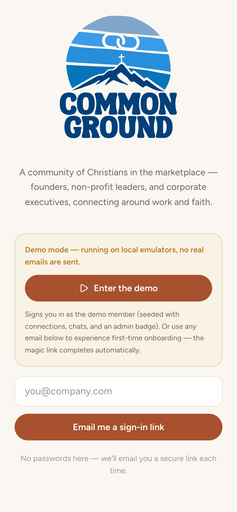
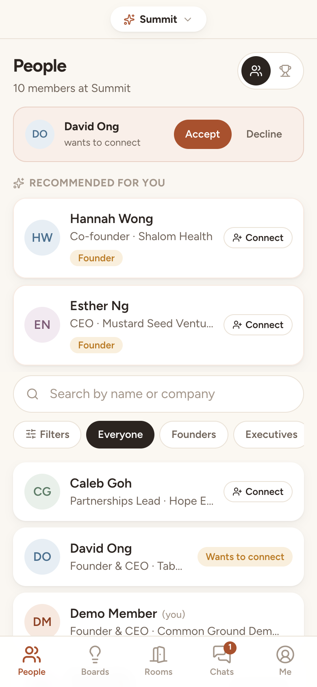
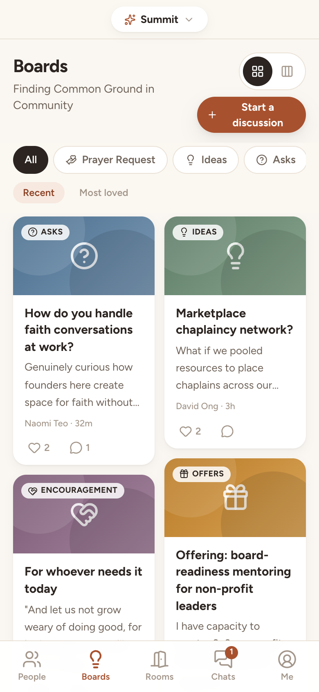
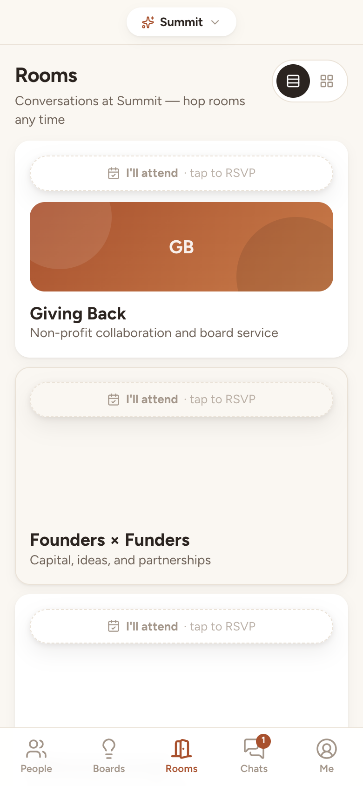
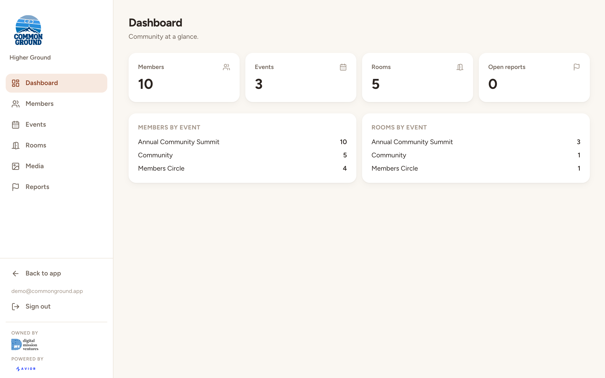

# Common Ground — web-app-cmngrd

A mobile-first PWA that is the digital home for a faith-in-the-marketplace community:
a live-conference companion (find people, spark conversations, hop discussion rooms)
and an ongoing community space (idea board, DMs, connections).

This repository is a self-host template. It ships with no member records, no admin
records, and no Firebase project credentials. Connect your own empty project
before anyone can sign in. Host setup — database, Higher Ground admin, and mail
through Resend or SendGrid — is in [SETUP.md](SETUP.md).

## Creator

Glenn built this template. He runs [Zavior](https://zavior.ai/). He also serves on the boards of SGDCC Foundation and IIPCC Singapore, the RegTech subcommittee of the Singapore FinTech Association, and the council of the Singapore AI Association.

If you want to talk, email [discoveryversemedia@gmail.com](mailto:discoveryversemedia@gmail.com). More is on [LinkedIn](https://www.linkedin.com/in/glenntwh/).

**Stack:** Next.js 16 (App Router) · React 19 · TypeScript · Tailwind 4 ·
Firebase (Auth email-link + Firestore with security rules) · standalone output
for Cloud Run behind Firebase Hosting.

## Demo

The screens below are the local demo (`npm run demo:dev` after `npm run demo:emulators` and `npm run demo:seed`). The people, posts, and rooms are fictional sample data. This repository does not store member or admin records.

<p>
  
  
  
  
</p>



## Features

| # | Feature | Where |
|---|---------|-------|
| 1 | Attendee directory (search by name/company, filter by group) | `/` (People tab) |
| 2 | Gated contact details behind mutual connections | `/people/[uid]` + `firestore.rules` |
| 3 | 1-to-1 direct messages, unread badges, near-real-time | `/messages` |
| 4 | Idea board — Padlet-style wall with topics, reactions, comments | `/board` |
| 5 | Discussion rooms with live occupancy + one-tap hopping | `/rooms` |
| 6 | Passwordless magic-link sign-in | `/signin` |
| 7 | Installable PWA + offline shell | `public/manifest.webmanifest`, `public/sw.js` |
| — | Moderation: report anything, admin removes content/members | `/admin` |
| — | Multi-event switching (sample events: Summit / Community / Circle), admin-approved access | top-bar switcher + `/admin` |

## Events & approval

Members belong to one or more events (the seed script creates **summit**, **community**, and **circle**),
switched via the top-bar pill. People, Ideas, and Rooms are scoped to the active
event; Chats and connections are person-to-person and follow the member across
events.

- Access is an admin-granted tag: `members/{uid}.events` is writable **only by
  admins** (rules-enforced — the owner's writable key-set excludes it), so
  members cannot self-approve. New sign-ups see an "awaiting event access"
  state until approved (Admin → Members & event access, or
  `npm run seed -- --approve <uid> <eventId>`).
- Posting into an event requires approval for that event (rules-enforced);
  rooms are admin-created into a chosen event.
- Directory/board/room *reads* are scoped by query (any signed-in member is
  vetted); hard per-event read isolation was deliberately deferred for v1.

## Higher Ground (`/higherground`)

Higher Ground is the desktop admin dashboard at **`/higherground`** — a separate surface from
the member PWA, gated to admins. Unlike the member app (client-only, rules as the
API), the console adds a thin **server tier**: route handlers under
`/api/admin/*` use the **Firebase Admin SDK** to do things clients can't.

- **Bulk add members** — CSV upload, paste-from-spreadsheet, or single-add, with
  a validate/preview step then a chunked commit. Each import **pre-creates the
  Firebase Auth account + full member profile + contact card + event approvals**,
  so imported people sign in via magic link and land straight in the app (no
  ProfileSetup). Re-imports match by Auth uid; event approvals are *unioned*
  (never clobbered); failures download as a retry CSV.
- **Members** — search, edit, per-event approval, ban/unban, grant/revoke admin
  (admins can't be written from a client — SDK only), delete.
- **Events** CRUD (delete guarded against orphaning rooms/posts), **Rooms** per
  event (create/edit/delete/reassign; delete is recursive) with optional agenda
  details (date/time/location, lobby order), featured people (speaker/moderator
  picked from the event's members), and downloadable files (uploaded via
  `/api/admin/files`, cleaned up on remove/delete), **Reports** triage
  (parity with the in-app admin page), and the `dmRequiresConnection` toggle.

**Auth**: the console reuses the app's Firebase magic-link sign-in, then attaches
the user's ID token as a bearer credential; every `/api/admin` route verifies the
token *and* that the uid is in `admins/{uid}`. No session cookie, no extra IAM —
`verifyIdToken` needs only the runtime service account's Firestore access.

**Runtime env**: server routes use the `(default)` Firestore database unless
`FIRESTORE_DATABASE_ID` is set (Cloud Run via `cloudbuild.yaml`). Demo mode sets
the emulator hosts via `npm run demo:dev`. Bootstrap the first admin with
`npm run seed -- --admin <uid>`. See [SETUP.md](SETUP.md).

## How contact-gating is enforced (feature #2)

Enforced in **Firestore security rules**, not the UI:

- Public profile (`members/{uid}`) holds **only** name / title / company / group.
  The rules' `create`/`update` clauses use `keys().hasOnly(...)`, so contact
  fields *cannot even be written* into the public doc.
- Email, phone, and LinkedIn live in a separate doc: `members/{uid}/private/contact`.
  Its read rule is:
  `request.auth.uid == uid || connection(pairId(me, uid)).status == 'accepted'`.
  An unconnected client gets `PERMISSION_DENIED` from the server — the fields never
  appear in any network response, search result, or API payload.
- Connections are single docs keyed by the canonical sorted pair id
  (`uidA_uidB`), so there is exactly one doc per pair; only the **recipient**
  can flip `pending → accepted`; either side can delete, which instantly
  re-locks contact details in both directions.
- There is no server middle-tier that could leak: the app talks to Firestore
  directly, so the rules are the API surface.

**Proof**: `npm run test:rules` runs 50 assertions against the Firestore
emulator (needs Java on PATH, e.g. `brew install openjdk`), covering: contact
docs denied to unconnected/pending/third-party members, unlocked for both after
accept, re-locked on disconnect, contact fields rejected from the public doc,
the DM-scope flag in both modes, and all moderation/admin permissions.

## Config flags

| Flag | Where | Effect |
|------|-------|--------|
| `dmRequiresConnection` | Firestore doc `config/app` | **The DM-scope toggle (feature #3).** `false` (default): any member can DM any member. `true`: starting a thread *and* sending messages require an accepted connection. Read live by both the UI and the security rules — flip the field (`npm run seed -- --dm-connections on|off`), no deploy needed. |

## Demo mode (no Firebase project needed)

Runs the full app against local emulators with seeded data — real magic-link
flow (the "email" is fetched from the Auth emulator), real security rules.
Needs Java on PATH for the emulators (`brew install openjdk`).

```bash
npm run demo:emulators   # terminal 1 — Auth + Firestore emulators
npm run demo:seed        # terminal 2 — demo member, directory, posts, rooms, DMs
npm run demo:build && PORT=3101 npm start
```

For a live dev server that also exercises the admin server tier (the
`/api/admin/*` routes need the emulator hosts in the *server* process), use
`npm run demo:dev` instead of the build+start above — then open
http://localhost:3000 (or `/higherground` for the admin console).

Open http://localhost:3101 and hit **Enter the demo** — you're signed in as an
admin demo member with an accepted connection (contact details unlocked), an
incoming connection request, an unread DM, a lively idea board, and three rooms.
Sign in with any other email (in a second browser/incognito) to test onboarding
and the two-sided connect → accept → unlock flow. Emulator data resets when the
emulators stop; just re-run `demo:seed`.

## Setup

Full steps for a blank Firebase project, the first Higher Ground admin, mail
through Resend or SendGrid, and a Supabase alternative are in [SETUP.md](SETUP.md).

Short version:

1. Create a Firebase project, a Firestore database on `(default)`, and a web app. Enable Email link sign-in.
2. `cp .env.local.example .env.local` and fill in the `NEXT_PUBLIC_FIREBASE_*` values. Do not commit `.env.local`.
3. Install and run (Node 22):
   ```bash
   npm install
   npm run dev
   ```
4. Deploy rules and indexes (the rules are the API):
   ```bash
   firebase deploy --only firestore:rules,firestore:indexes,storage
   ```
5. Seed config once, then grant yourself admin after the first sign-in:
   ```bash
   GOOGLE_APPLICATION_CREDENTIALS=path/to/key.json npm run seed -- --rooms
   npm run seed -- --admin <your-uid>
   ```

### Production

`next build` produces standalone output (`Dockerfile` → Cloud Run, fronted by
Firebase Hosting via `firebase.json` rewrites). Any Node host works. The PWA
bits (`manifest.webmanifest`, `sw.js`, icons) are plain static files.

Regenerate icons with `python3 scripts/generate-icons.py`.

`cloudbuild.yaml` is a template. Set the Firebase web config as Cloud Build
substitutions on your own project. The image and Cloud Run service are named
`web-app-cmngrd`. Do not put API keys in the committed file.

**Image hosting (Cloud Storage).** User images (avatars, profile covers, idea
images) upload straight from the browser. Admin media-library and room-cover
uploads go through `/api/admin/media` using the Admin SDK. Objects are stored
under a `cmngrd/` prefix in your project's bucket.

- **Bucket resolves server-side.** The Admin SDK reads `FIREBASE_STORAGE_BUCKET`,
  falling back to `NEXT_PUBLIC_FIREBASE_STORAGE_BUCKET`.
- **Service-account permissions.** The Cloud Run runtime service account needs
  `roles/storage.objectAdmin` on that bucket for the admin upload and delete routes.

## Data model (Firestore)

```
members/{uid}                    public profile (name, title, company, group)
members/{uid}/private/contact    email / phone / linkedin  ← rule-gated
connections/{uidA_uidB}          status: pending | accepted
threads/{uidA_uidB}              DM thread metadata + reads map
threads/{id}/messages/{id}       DM messages
posts/{id}                       idea-board cards (+ reactedBy[], counts)
posts/{id}/comments/{id}         comments
rooms/{id}                       admin-created rooms (+ optional agenda: date/
                                 time/location/order, people[], files[])
rooms/{id}/participants/{uid}    live presence (own doc only)
rooms/{id}/messages/{id}         room discussion
reports/{id}                     member-filed reports (admin-only read)
admins/{uid}                     admin allow-list (seed script / console only)
banned/{uid}                     banned members (blocks new writes)
config/app                       { dmRequiresConnection }
```

## Assumptions & deferrals

- **Scale**: community-sized (hundreds of members, dozens of rooms). Directory
  search filters client-side; room occupancy uses one collection-group listener.
  Both are the simplest correct thing at this scale.
- **Declining a request deletes the doc**, so the requester can ask again later
  (no permanent block-list in v1; report → admin removal covers abuse).
- **Counts are advisory**: `reactionCount` is rule-verified against the reaction
  list, but `commentCount` is client-maintained (display-only; not a privacy
  surface). Cross-doc transactional validation was deliberately skipped for v1.
- **Reported DMs aren't readable by admins** (DMs stay private to participants);
  the admin panel directs moderators to follow up with the parties. Removing the
  offending *member* is the enforcement lever.
- **Banning** blocks all new content writes via rules and removes the profile;
  fully disabling the Auth account is a console action (documented, not built).
- **Deleting a post** leaves orphaned subcollection comments (invisible in UI);
  lazy cleanup is acceptable at v1 scale.
- **Presence** clears on navigation/unmount; a killed browser can leave a stale
  participant doc until the member next opens a room. Accepted for v1 (no
  server-side heartbeat).
- Deferred (per spec): ticketing/payments, agenda, calls, group chats outside
  rooms, public pages. Also deferred: push notifications, email digests,
  avatars/photo upload (data minimalism), rate limiting.

## Creator

Glenn built this template. He runs [Zavior](https://zavior.ai/). He also serves on the boards of SGDCC Foundation and IIPCC Singapore, the RegTech subcommittee of the Singapore FinTech Association, and the council of the Singapore AI Association.

If you want to talk, email [discoveryversemedia@gmail.com](mailto:discoveryversemedia@gmail.com). More is on [LinkedIn](https://www.linkedin.com/in/glenntwh/).
